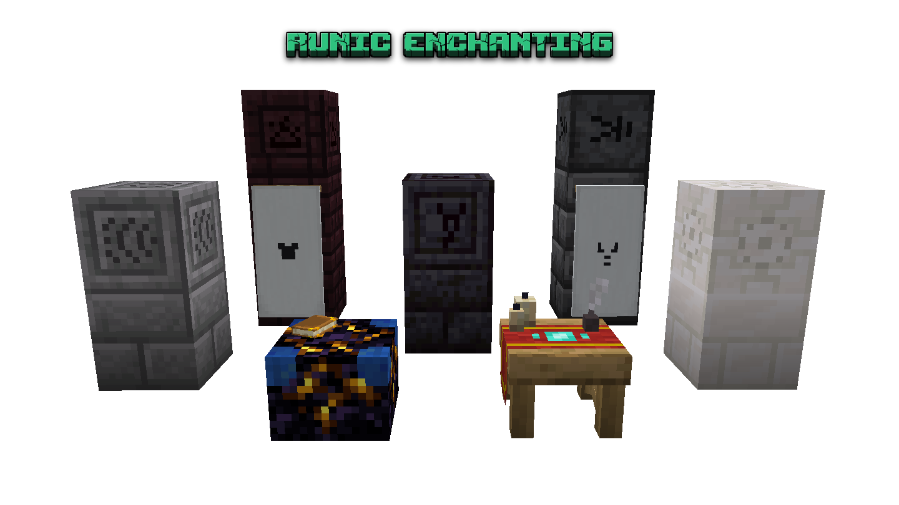
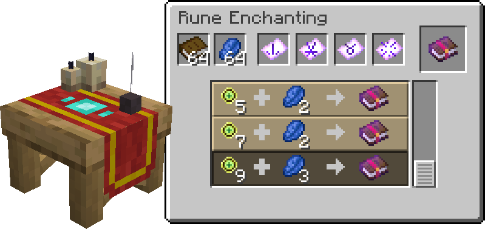
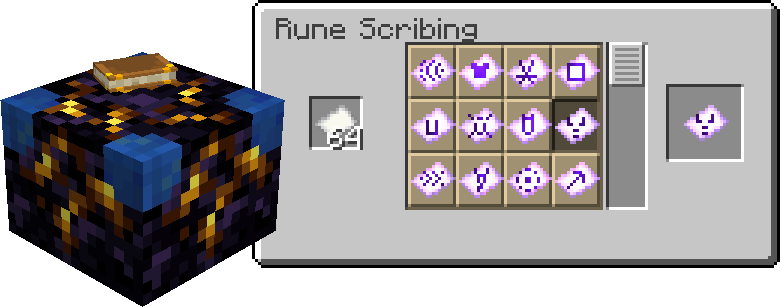
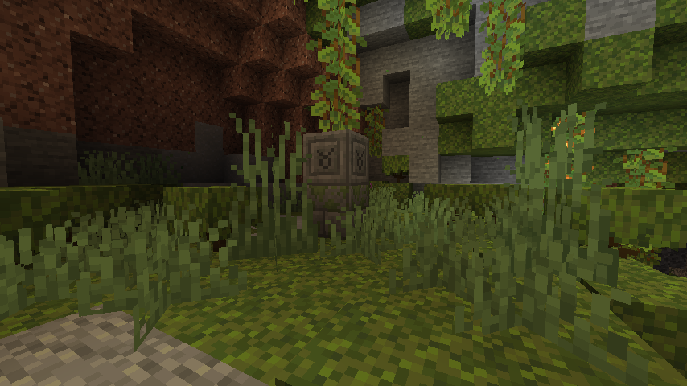
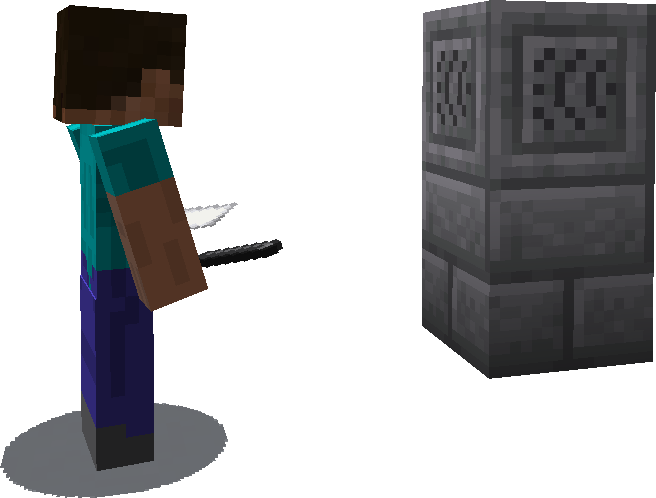
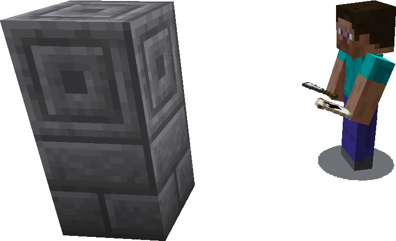

<strong>Runic Enchanting</strong> adds a way to craft enchanted books using runes found throughout the world.
  

Every enchantment can be crafted with a sequence of rune pages at the <strong>Rune Enchanting Table</strong>.
  

Rune pages are written at the <strong>Rune Scribing Table</strong>. Much like how the vanilla enchanting table behaves with bookshelves, the Rune Scribing Table needs <strong>Rune Blocks</strong> nearby. Inorder to craft a rune page the corresponding rune block must be within range of the Scribing Table.
  

Rune Blocks generate naturally in the Overworld and Nether dimensions. You can find a variety of Rune Structures on the surface, in caves, and even underwater. Each structure will have one or more rune blocks. This is a Life Rune carved onto a chiseled stone bricks block, which generated in a lush caves biome.
  

Rune blocks when mined will drop their respective chiseled block variant, even with the Silk Touch enchantment. To obtain rune blocks for the Scribing Table use <strong>Chalk</strong> on the block while holding paper in the offhand. This will make a <strong>Rune Pattern</strong> of that rune, which can be used to make additional rune blocks in the future.
  

A rune pattern has no durability, so will never break, and is not used up in the process of making a rune block. Once a rune pattern is obtained it can be infinitely used to make new rune blocks. To make a rune block, use a <strong>Chisel</strong> on any chiseled block, like chiseled stone bricks, while holding the desired rune pattern in the offhand. This will convert the chiseled block into a rune block.

Rune Patterns can also be used at the Loom to draw patterns on banners, which can then be applied to shields.
  

If you have ideas, or want to talk about Runic Enchanting, consider joining the discord.

